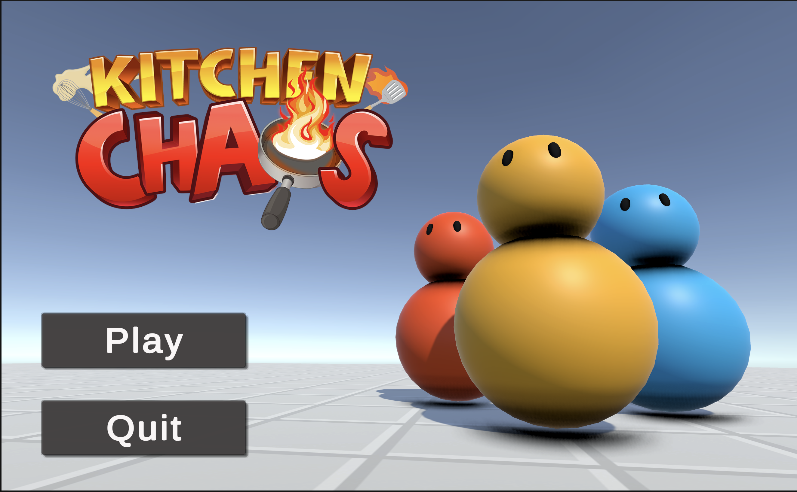
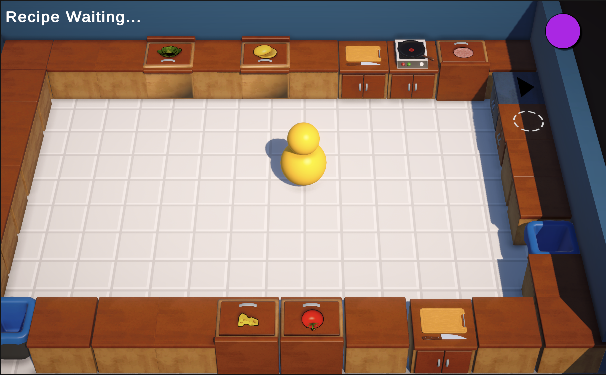
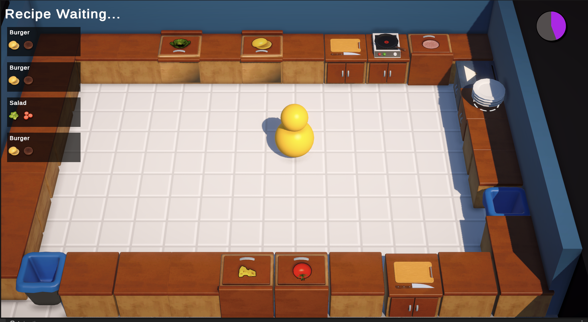
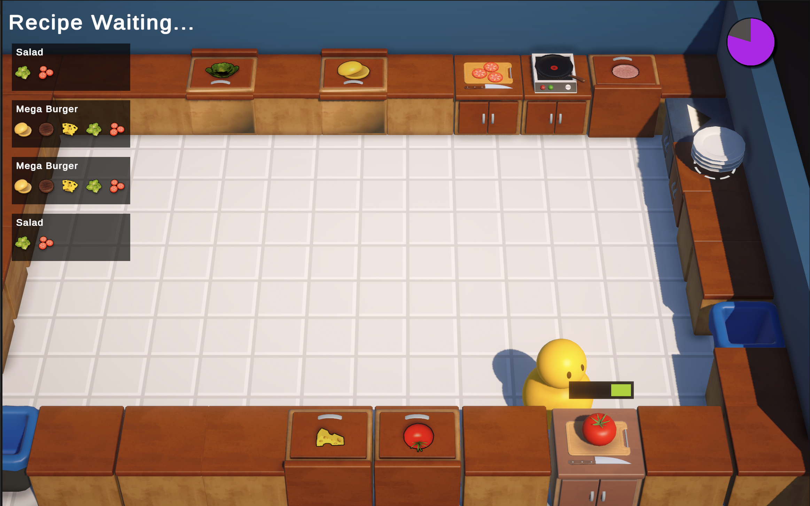

# Kitchen Chaos
[](https://unity.com/)

**Kitchen Chaos** is a high-performance 3D Cooking Simulation game built with Unity and C#. This project serves as a technical showcase of **Event-Driven Architecture**, **Clean Code principles**, and **Modular Game Design**.

---

## 📸 Media Gallery

### Gameplay Preview
| **Screenshot 1** | **Screenshot 2** | **Screenshot 3** | **Screenshot 4** | **Screenshot 5** |
| :---: | :---: | :---:| :---:| :---: |
|  |  |  |  | 

---

## 🛠 Technical Implementation

### 1. Modular Station Architecture (Inheritance & Interfaces)
Instead of using a monolithic script to handle all interactions, I implemented a **BaseCounter** class. Each specific station (Cutting, Frying, Delivery) inherits from this base.
* **Interface Implementation:** Used `IHasKitchenObject` to ensure that both the Player and Counters can hold items using the same logic.
* **Scalability:** New stations (e.g., a "Blender") can be added by simply extending the `BaseCounter` without modifying the `Player` script.

### 2. Event-Driven Logic (Decoupling)
To ensure high performance and clean debugging, I separated the **Core Simulation** from the **Visual/UI Layer** using C# Actions and Events.
* **The Benefit:** Visual elements like Progress Bars and Animation Controllers listen for events (e.g., `OnProgressChanged`) rather than checking state every frame in `Update()`. This significantly reduces CPU overhead.

### 3. Data-Driven Design with ScriptableObjects
All recipes, cutting counts, and frying times are defined via **ScriptableObjects**.
* This allows for "Hot-Swapping" game balance values without needing to recompile code.
* It enables a flexible **Recipe System** where the game can dynamically validate if a combination of ingredients matches a delivery order.

---

## 🚀 Key Features
* **Modern Input System:** Fully rebindable controls supporting Keyboard, Mouse, and Gamepads.
* **Advanced State Machine:** Manages game flow through `WaitingToStart`, `Countdown`, `Active`, and `GameOver` states.
* **Collision & Interaction:** Optimized Raycasting system for precise object detection on specific Physics Layers.
* **Sound & VFX Management:** Global managers using one-shot pooling for audio feedback during cutting, frying, and walking.

---

## 🏗 Project Structure
```text
KitchenChaos/
├── Assets/
│   ├── _Assets/             # Models, Textures, and Materials
│   ├── Scripts/
│   │   ├── Counters/        # Logic for all station types (Cutting, Stove, etc.)
│   │   ├── Player/          # Movement and Interaction Controller
│   │   ├── ScriptableObjs/  # Recipe and KitchenObject data
│   │   └── UI/              # Decoupled UI Controllers and HUD
│   └── Media/               # Screenshots and Videos for Documentation

## 🧠 Technical Challenges & Solutions

### 1. Multiplayer Synchronization (Netcode for GameObjects)
**Challenge:** Synchronizing the state of a "Kitchen Object" (like a Tomato) across the network when a player picks it up, cuts it, or places it on a counter.
**Solution:** I implemented a **Server-Authoritative** model using Unity's Netcode for GameObjects. 
* Used `NetworkVariable` to sync the state of progress bars (cutting/frying) so all players see the same progress.
* Implemented `[ServerRpc]` for interaction requests to ensure that two players cannot "grab" the same object at the same exact frame, preventing race conditions in the game logic.

### 2. The Multi-Step Frying Logic (State Machine)
**Challenge:** Handling the transition of a steak from `Raw` → `Cooked` → `Burned` while managing UI updates and sound effects simultaneously.
**Solution:** I developed a state-driven logic within the `StoveCounter`. By using a timer-based check against a **ScriptableObject** data set, the counter independently manages its own state. 
* This decoupled the logic: the Stove only cares about the timer, while the **Sound Manager** and **UI** simply listen for state change events to trigger the "sizzling" audio or the "warning" flashing effect.

---

## 🎓 What I Learned

### 🛠 Scripting & Architecture
* **Event-Driven Programming:** Mastered the use of `System.EventHandler` to decouple game systems, leading to a codebase that is easier to extend and unit test.
* **Interface-Based Design:** Learned how to use Interfaces (`IHasKitchenObject`) to create a flexible interaction system where any object can be a "parent" to a kitchen item.
* **State Machines:** Gained deep experience in managing complex object states (e.g., Frying, Cutting, Game Flow) using enum-based state machines.

### 🌐 Multiplayer & Networking
* **Network Topology:** Understood the difference between Client-Authoritative and Server-Authoritative logic.
* **Latency Compensation:** Learned how to handle "Visual Smoothing" on the client side while the server processes the heavy logic.

### 🎨 3D & Technical Art
* **3D Physics & Raycasting:** Optimized interaction ranges and collision layers to ensure smooth gameplay in a crowded 3D environment.
* **VFX & Sound Integration:** Learned how to utilize **Shader Graph** for world-space progress bars and how to manage global audio systems that don't overlap or distort.

### 📈 Project Management
* **Modularization:** Learned how to structure a Unity project so that art assets, UI, and core logic are isolated, allowing for parallel development.
